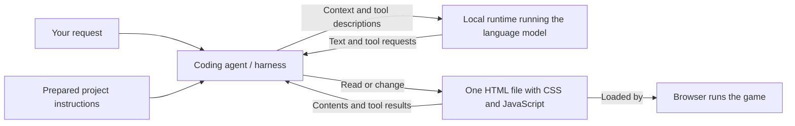

# Workshop plan

## Published description — keep unchanged

During this workshop, kids will use AI to help build a simple computer game. Instead of prompting blindly, they will look under the hood: what the AI is actually doing, which techniques make the game work, and how a prompt turns into code and behavior. They will then change the game on purpose and see why understanding the underlying technologies still matters - it is what lets you steer the result, not just hope for it.

## Agreed direction

- Audience: kids aged 9–15.
- Duration: 45 minutes, with an optional extension to one hour.
- Equipment: M1 MacBooks with a coding agent and local inference installed before the session. The current organizer plan is Pi and Qwen 3.6; exact model, quantization, RAM, and inference runtime still need confirmation.
- Stack: native HTML, CSS, and JavaScript. Canvas draws the game. No framework, build step, package installation, remote assets, or game-time AI calls.
- Game: a small dinosaur runner inspired by the familiar browser game, using our own simple drawings.
- Start from the prepared game foundation so the local model can focus on small rule changes. While the agent prepares the working copy, the facilitator explains the architecture; continue that explanation if copying finishes early.
- Teach generic roles and concepts. Product names belong in setup notes, not the teaching narrative.
- Keep prompts and intermediate results in this repo so slow or failed inference does not stop the session.
- The foundation, working game, and each save point are single HTML files containing their own CSS, JavaScript, and drawings. The working game is `index.html` in the repository root.
- Kids type short prompts describing the game or the change they want. Example wording lives in `prompts/`; implementation constraints and defaults live in the root `AGENTS.md`, loaded by the coding agent. The examples are guides, not mandatory wording.
- Short step guides live directly in `AGENTS.md`. The agent follows the matching step, reuses the embedded resources in `foundation/runner.html`, and preserves existing work. Describe supplied code and generated changes accurately.
- A presentation is wanted later. It has not been created yet.

Group size, individual versus paired work, teaching language, and prior coding experience remain open. Candidate timings, prompts, parameter values, and optional features should be adjusted after rehearsal.

## Learning outcome

Each participant should be able to show one deliberate change, identify the code responsible, and explain how they checked its effect.

The central rhythm is: describe → prepare → play → predict → generate a change → test → explain.

## Game scope

The dinosaur stays at a fixed horizontal position. Cacti move from right to left, creating the impression of running. Space makes the dinosaur jump. Touching a cactus ends the run; passing one earns one point. A restart button resets the game.

The baseline has one obstacle type and a fixed speed. Keep the art simple enough to draw with canvas shapes. Use one `index.html` in the repository root, with three parts inside:

| Part | Role |
| --- | --- |
| HTML | Page, instructions, score, restart button, canvas |
| Embedded CSS | Page layout, colors, and typography |
| Embedded JavaScript | Input, game state, physics, obstacles, collisions, and drawing |

Put the main adjustable values together in a clearly labeled `CONFIG` object. The [agent instructions](../AGENTS.md) specify names so the manual activity is easy to locate; children do not need to include them in a prompt. These are workshop conventions, not requirements for every game program.

## 45-minute core

| Minutes | Activity | Purpose |
| --- | --- | --- |
| 0–5 | Show the target game, state the rules, have kids type their build request | Establish what a successful result should do |
| 5–12 | Prepare the game from the foundation and explain the architecture | Connect the prompt, prepared code, model, tools, files, and browser |
| 12–18 | Open and play the game; locate its HTML, CSS, and JavaScript | Connect generated code to visible behavior |
| 18–27 | Explain the jump, predict a change, manually edit one value | Experience a direct cause and effect |
| 27–40 | Request one chosen rule change, inspect it, and playtest | Steer and evaluate the AI's work |
| 40–45 | Share a change and explain why it works | Check understanding |

For a 60-minute session, add ten minutes of partner playtesting and improvement before the closing activity, and extend sharing by five minutes.

Plan for two AI requests per participant: prepare a playable copy, then generate one feature edit. Repair requests are recovery options, not required lesson stages. Use the inference time for explanation, prediction, or preparing a test. The first request reuses the foundation; generating a whole game from scratch is a separate rehearsal option. Do not make the explanation depend on either request taking exactly seven minutes.

If the game finishes early, leave it ready until the explanation ends. If it is still generating when playtime begins, stop the outstanding request before switching to a verified save point. Rehearsal will determine a shorter waiting limit for the feature request; two minutes is an initial target, not a performance promise.

## Architecture explanation during preparation

| Role | Explanation for participants |
| --- | --- |
| Language model | Generates text, including code and requests to use tools, from the context it receives |
| Local inference runtime | Loads the model and computes its responses on the laptop |
| Coding agent / harness | Assembles context, talks to the model, carries out tool requests, and sends results back |
| Working HTML file | Stores the prepared HTML, CSS, and JavaScript, including our generated changes |
| Browser | Loads the file, runs JavaScript, and displays the game |

The coding assistant combines a harness with a model connection. The model itself does not directly edit the filesystem. The harness executes requested actions and may ask the model for another response using their results.

Show that the child's short request is only part of the context: the harness also loads the prepared project instructions. That one file contains the web stack, single-file format, useful defaults, and short step guides. The first step points to a prepared foundation containing the page, drawings, and baseline rules. Show the copy separately from the later generated rule edit. The child chooses the desired behavior without needing to repeat that setup. Include this in the later presentation so the result is not presented as coming from the short prompt alone.

Show the file copy and, during the feature activity, a real edit in the agent interface. Explain that the harness can return errors and file contents to the model, but the model only receives feedback actually supplied to it. Do not imply that it automatically sees the browser, checks game feel, or knows a change worked.

The model generates responses in small pieces of text called tokens. Training gives it patterns it can use to produce code; a plausible response is not proof that the game behaves correctly. Keep this brief and return to the visible workflow.

Once the HTML file exists, the browser can run this game without the model or harness. Close the coding agent during rehearsal and show that the game still works. With the planned local setup, both generation and gameplay can happen on the laptop; verify this before claiming the workshop works offline.

## Game explanation and manual experiment

Teach the concepts through one jump:

1. A key press is input.
2. Position, vertical speed, and score are remembered state.
3. Jumping sets an upward vertical speed. Gravity changes that speed over time, bringing the dinosaur back down.
4. Each animation frame updates positions, checks rules, and draws again.
5. Overlapping rectangles indicate a collision. The dinosaur does not need to recognize a cactus as an object.

The baseline uses downward-positive screen coordinates: the initial upward velocity is `-CONFIG.jumpSpeed`. The configuration value is a positive magnitude, so increasing it makes the jump higher. Explain the sign only as far as useful for the group.

Manual activity:

1. Find `jumpSpeed` in the embedded script in the root `index.html`; note the current value.
2. Predict what increasing it will do.
3. Change the candidate value from `650` to `780`, save, and refresh the browser.
4. Play and compare with the prediction. Point to the code that applies the value.
5. Keep the change or restore it deliberately. Save this version before asking AI for a feature.

Optionally set `showHitboxes` to `true` to reveal collision rectangles. No extra inference request is needed for these manual activities. Rehearse the exact editor, save action, and browser refresh the kids will use.

## Deliberate AI changes

Offer one choice per participant:

- Double jump: one extra jump while airborne; landing restores the allowance.
- Moon mode: lower gravity selected before a run; compare airtime with normal mode.
- Progressive speed: obstacles move faster every five points, up to a defined cap.

Before prompting, the participant describes the desired behavior and how to test it, then types their request. Offer the short examples in `prompts/` when helpful; let them use their own words. Afterward, inspect the relevant edit and play. More confident kids can explain or modify the condition; beginners can identify the changed value or rule and demonstrate its effect. Challenges are chosen by confidence and interest, not assigned rigidly by age.

If participants work in pairs, rotate keyboard and prediction/testing roles. Keep debugging inside playtesting rather than adding a separate debugging lecture.

## Fallbacks and later deliverables

The [save-point guide](../checkpoints/README.md) links to a prepared baseline, a higher-jump version, and separate examples of each offered feature. Each is one self-contained HTML file, with its suggested prompt and preparation notes in an HTML comment. The code and generation source are versioned in the repo. These are prepared reference implementations; they are not recorded local-model outputs. Browser checks on the M1 remain part of rehearsal. Future local-model results should record the actual typed prompt, instruction revision, and any repair steps. Generated outputs need not match byte for byte.

If inference fails, explain that the group is using a prepared AI-assisted version, then continue the manual experiment and inspection. Stop pending agent edits and back up the participant's current `index.html`. Copy the chosen HTML save point to `index.html` in the repository root, then continue editing that copy. No format change is needed. See [recovery steps](../checkpoints/README.md).

After rehearsal, prepare the presentation around one architecture diagram revealed in steps, one jump diagram, a before/after change, and the closing question: “Show something you changed, point to the code responsible, and explain how you checked it.” Use actual code from the verified game. Finalize student prompt cards, facilitator notes, and save points together so they refer to the same version.
